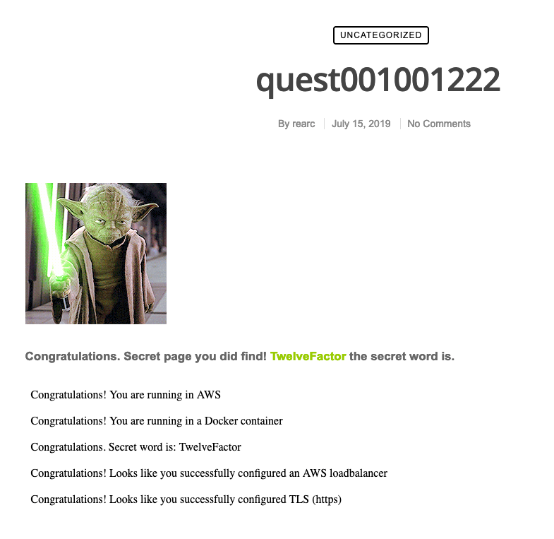

# Jason Tasker - Rearc Quest

## Notes
This is a POC and not intended to be run full time.  There are some IAM policies that may provide too much access. Please destroy the resources shortly after deployment.

## Screenshot

## Architecture
* S3 - bucket for artifacts and terraform state files
* Codepipeline - Pipeline to build and deploy resources. Then tear down resources.
* Codebuild - Used to deploy terraform resources for the project and upload Dockerfile to ECR.
* ECR - Repository to store the container image needed
* ECS - Deploy container to EC2 instances
* IAM Certificate - store self-signed certificate for the ALB since ACM needs a valid DNS entry
* ALB - Provide HTTPS access to container website
* IAM - Roles and policies needed to deploy AWS Services

## Requirements

* Terraform >= 1.2.0
* Terraform AWS Provider >= 4.16

* S3 bucket - named "tasker-demo-artifact" - Hardcoded for this POC and should be adjusted for real world deployments. Bucket is used for code artifacts and Terraform State files.
* Allowed CIDR Block - 99.32.72.96/32 - Hardcoded to my IP for this POC and should be adjusted for real world deployments. Adjust terraform/container/terraform.tfvars

## Resources used

* AWS Account
* VPC
* EC2
* S3
* ECS
* ECR
* CodeBuild
* CodePipeline
* IAM
* Elastic Load Balancer

## Deployment
* Assuming you have terraform installed and have AWS credentials configured in your environment to deploy IAM, codepipeline, and codebuild resources.

1. git clone repository
2. cd into repository directory
3. cd terraform/start
4. terraform init
5. terraform validate
6. terraform apply
7. View deployment in codepipeline
8. **delete process** Approve stage in pipeline to destroy resources
9. **delete process** terraform destroy

## Deployment Explanation
1. terraform/start - Deploy codepipline that uses codebuild to deploy the infrastructure needed.  The build process installs terraform, deploys terraform/infrastructure to create ECR and VPC, then deploys the Dockerfile to ECR. Then the build will deploy terraform/container to deploy ECS.
2. terraform/infrastructure - Deploys ECR and VPC. Uses Terraform VPC module by terraform-aws-modules
3. terraform/container - Deploys the ECS container, IAM Certificate, and Application Load Balancer. Uses a custom Terraform module as an example but could be adjusted to use the Terraform ECS module

## Recreate self-signed certificate if needed
1. cd terraform/container/modules/ecs/ssl
2. openssl genrsa 2048 > privatekey.key
3. openssl req -new -x509 -nodes -sha256 -days 365 -key privatekey.key -outform PEM -out certificate.crt ** Prompts for Certificate information like Country, State, Company, etc - https://docs.openssl.org/1.1.1/man1/x509/ **

## Improvements given more time
1. Switch Codepipeline to use Github as source instead of S3 and fully implement a CI/CD process
2. Use ACM for ALB certificate (requires valid DNS zone and Route53)
3. Use Terraform ECS module by terraform-aws-modules
4. Add static code analysis like checkov, tfsec, terrascan, tflint, etc to the build process for detecting security issues or misconfigured terraform code 
5. Adjust repo to source Rearc code and adjust Docker container to pull from this repo instead of the Rearc code repo
6. Deploy via Fargate to reduce running costs
7. Enable encryption at rest if Container has any sensitive information provided
8. Configure encryption in transit if Container has any sensitive information provided
9. Performance based scaling would be needed to properly size the deployment of this application
10. Add some unit testing
11. Add functional tests
12. Add end to end tests
13. Considier adding multiple environments following something similar to DTAP (Development, Test, Acceptance, Production) for fully testing code changes
14. Implement Web Application Firewall and do security scans on the deployment on occasion
15. Seperate out the infrastructure deployment from the applicaion to simplify the environment